# Aula 1 - Ciência de Dados

## O que são Dados?

> Referem-se a elementos digitais que foram coletados e armazenados de forma estruturada ou não estruturada. Pode ser na forma de números, texto, imagens, áudio ou vídeo.

##### Como devemos tratar os dados?

- Questões a respeito dos Dados
- Tipos: 
	Datas, Numéricos, Alfanuméricos
- Organização: 
	Estruturados, Não-Estruturados, Semiestruturados
- Armazenamento: 
	Servidor de Banco de Dados Local ou na Nuvem

##### Novas Tecnologias -> Mais Dados

- Os 5 V's
- Volume:
	Quantidade de Dados
- Velocidade:
	Geração e Processamento
- Veracidade:
	Garantia de Autenticidade dos Dados
- Variedade:
	Tabelas de Bancos de Dados, Arquivos Texto, CSV, Imagens
- Valor:
	Qual a vantagem competitiva

##### O que Queremos Alcançar?

> Dados > Informação > Conhecimento

## O que é tomada de Decisão?

##### Grande motivação da Ciência de Dados

- Perguntas que precisamos responder
- O que fazer?:
	Definir estratégias e táticas
- Quando agir?:
	Escolher o momento adequado
- Quem são os responsáveis?:
	Identificar e atribuir papéis de responsabilidade para os indíviduos

##### Em que se basear para tomar decisões?

- Fundamentos
- Dados confiáveis:
	Somente com dados corretos, podemos fazer mensurações corretas
- Processos bem definidos:
	Análises, Aprendizado de Máquina, Estatística, Otimização
- Viabilidade:
	Profissionais bem preparados, Tecnologia, Demanda

##### Estabelecer metas e trabalhar para alcançá-las

- Nossas metas
- Maximizar retorno:
	Produtos e serviços que atendam às demandas dos clientes
- Aumentar engajamento:
	Reconhecimento de qualidade pelos usuários
- Redução de custos:
	Utilização racional dos recursos
- Redução de vulnerabilidades:
	Melhoria da definição e ajustes dos processos
- Ações eficazes:
	Resolver problemas da melhor forma

##### Como concretizar uma solução eficaz?

> Ciência x Tecnologia x Conhecimento do negócio

## Estatística e Ciência de Dados

##### Metodologia de trabalho bem estabelecida

- Perguntas que precisamos responder
- Como organizar os dados?:
	Precisamos tratar os dados
- Quais as informações relevantes?
	Precisamos estabelecer um guia de prioridades
- Quais métodos devemos aplicar?
	Devemos escolher as técnicas adequadas

##### Como a estatística auxilia a Ciência de Dados?

- Fundamentos
- Visualização de Dados:
	Ajuda-nos a ter uma melhor compreensão do que estamos lidando
- Distruibuição de Dados:
	Identificação de padrões (caso existam)
- Estimativas e classificações:
	Métodos específicos e bem fundamentados

##### Confiança nos resultados

- Nossas metas
- Engajar as pessoas:
	Os gráficos e tabelas são uma forma das pessoas se engajarem
- Confiar no processo:
	Não estamos "reinventando a roda"
- Estimar prazos:
	Quanto tempo para obter os resultados?
- Estimar custos:
	Qual o investimento para viabilizar o projeto?
- Ter elementos de comparação:
	Comparar o estimado e o obtido

##### Como encontrar relações relevantes?

> Metodologia bem estabelecida
> (Variáveis de resumo, Distribuições, Séries temporais...)

## Linguagem de Programação Python

##### Porque uma linguagem de Programação?

- Perguntas que precisamos responder
- Tem sintaxe simples?:
	Precisa ter bibliotecas que acelerem o processo de desenvolvimento
- Possui ambientes de desenvolvimento?:
	Os ambientes de desenvolvimento (IDE) devem ser fáceis de trabalhar
- Tem documentação de boa qualidade?:
	Deve ter material oficial para fazer consultas

##### Vantagens do Python

-Fundamentos
-Várias IDEs:
	Google Colab, PyCharm, Spyder 
-Muitas bibliotecas e frameworks:
	Assim, podemos focar na solução do negócio em si 
-Comunidade engajada: 
	Muita documentação e exemplos disponíveis na Internet e em livros

---

# Aula 2 - Distribuições de Probabilidade

## O que é probabilidade?

> Definição:
> É um ramo da matemática que estuda eventos ou fenômenos aleatórios. Cuja preocupação está na medição e quantificação da incerteza ou aleatoriedade.

##### Exemplo de Probabilidade

- Qual a chance de sair "Coroa" no lançamento de uma moeda?
	50%
- Qual a probabilidade de um ativo ter um retorno de 10% no intervalo de um ano?
	Depende de diversos fatores

##### Elementos Fundamentais

- Questões a Respeito do Cálculo da Probabilidade:
- Eventos:
	Definir os resultados possíveis
- Repetições:
	Estabelecer a frequência de testes
- Experimento:
	Garantir que o processo seja "honesto"

##### Quais as principais distribuições de probabilidade?

- Principais Distribuições de Probabilidade
- Normal:
	A mais utilizada
- Binomial:
	Situações com dois resultados possíveis
- Multinomial:
	Extensão da Distribuiçãp Binomial
- Poisson:
	Muito utilizada em "processos de chegada"
- Exponencial Negativa:
	Muito utilizada em "processos de saída"

##### Para que precisamos das Distribuições de Probabilidade

> Compreensão dos Dados > Conhecimento

## Espaço Amostral, Amostra e Eventos

##### Espaço Amostral

- Conjunto dos resultados possíveis
- Exemplos:
- Espaço Amostral do Lançamento de uma Moeda:
	{"Cara", "Coroa"}
- Espaço Amostral do Lançamento de um Dado:
	{1, 2, 3, 4, 5, 6}

##### Amostra

- Conjunto do Espaço Amostral associado a uma origem
- Exemplos:
- Coleta de Dados com quantidade de falhas de equipamentos por fabricante:
	Fabricante		Quantidade de Falhas
		1 				10
		2				15
		3				5
		4				7

##### Eventos

- Subconjuntos do Espaço Amostral
- Exemplos:
- Resultado possível do Lançamento de uam Moeda:
	{"Cara"}
- Resultado possível do Lançamento de uam Dado:
	{1, 3, 5} #ímpares

##### A Importância das definições

> Como tomar decisões sem saber o que se quer medir?:
> É fundamental estabelecer desde o início do processo de análise o que queremos obeter e definir os conjuntos e etapas que vão nos guiar

## Variáveis Aleatórias: Contínuas e Discretas

##### Variável Aleatória

- Variável cujos valores possíveis dependem do resultado de um experimento probabilístico
- Podem ser:
	Discretas:
		Pode assumir valores finitos ou contáveis
	Contínuas:
		Pode assumir qualquer valor dentro de um intervalo

##### Variável Aleatória Discreta

- Variáveis que podem assumir valores finitos ou contáveis
- Exemplos:
	Lançamento de uma moeda:
		Qual o número de vezes que apareceu uma face?
	Lançamento de um dado:
		Qual o número de vezes que apareceu um número ímpar?

##### Variável Aleatória Contínua

- Podem assumir qualquer valor dentro de um determinado intervalo
- Exemplos:
	Estudo de Fenômenos Naturais
		Qual o ìndice pluviométrico de uma determinada região?
	Estudo de Confiabilidade de Equipamentos
		Qual a vida média dos motores dos caminhos de um determinado fabricante?

##### A Importância das Variáveis Aleatórias

> Qual o primeiro passo para melhorarmos um processo?
> Desenvolver métodos de medição
> Neste sentido, as V.As são um importante instrumento para alcançarmos esse objetivo

## Exemplo Prático de Distribuições de Probabilidade

##### A distribuição Binomial

> Fórmula para função de probabilidade binomial dada por:

> Sendo que:

> A distribuição binomial é usada para obter a probabilidade de observar:

##### Exemplo Conceitual

> Vamos supor que queiramos saber a probabilidade específica de que o lado "Cara" aparecerá exatamente 10 vezes depois de 20 lançamentos de moeda
> Solução:
	Para resolver esse problema, precisamos calcular a função de probabilidade da distribuição Binomial. Sendo que, e.

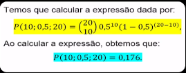

> Exemplo em Python

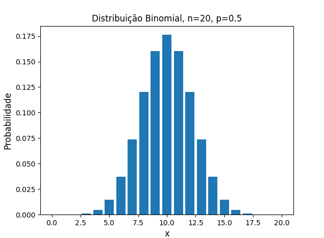

---

# Aula 3 - Princípios de Amostragem

## Definição de Amostragem

> É um instrumento que utilizamos para selecionar um subconjunto dos dados de uma população - ou seja, a amostra - de tal forma que sejam representativos.

#### Exemplo de Amostragens
> Qual a análise de sentimentos das pessoas sobre um filme?
> Quais são os fatores que podem influenciar na opinião das pessoas?
> Quais são as intenções de votos dos eleitores em um determinado político?
> Como o processo de coleta de dados foi realizado?

#### Princípios de Amostragem
> Tentativas de representar comportamentos

#### Dois princípios fundamentais
> Regularidade
	Seleção de muitos itens de forma aleatória
> Lei dos Grandes Números
	Seleção de grandes amostras

#### Consequências Práticas
> Compreensão de Comportamentos:
> Boas consequências:
	Aumentar as chances de sucesso de uma estratégia de investimentos
	Aumentar engajamento de um determinado público
> Más consequências:
	Tomar decisões erradas
	Não priorizar ações preventivas

## Tipos de Amostras

#### Distribuição Amostral da Média
> É o tipo mais comum de distribuição amostral
> É focada no cálculo da média de cada grupo de amostra que escolhemos dentro da população
> Por fim, precisamos exibir essas médias em um gráfico do tipo histograma

#### Distribuição Amostral de Proporção
> Tem foco no cálculo das proporções de uma população
> Selecionamos uma amostra e calculamos suas proporções
> Por fim, as médias das proporções da amostra de cada grupo representam a proporção de toda a população

#### Distribuição T
> É uma distribuição amostral que envolve uma população pequena ou sobre a qual não sabemos muito sobre ela
> Nós a utilizamos para estimar a média da população e outras estatísticas, como intervalos da confiança, diferenças estatísticas e regressão linear

#### A importância dos tipos de distribuições
> Por que existem tantos tipos de distribuições?
	Pois cada uma delas é mais útil em um determinado contexto
	Por exemplo, qual distribuição amostral você utilizaria, se tivesse poucos dados?

## Distribuições Amostrais

#### Histogramas
> É uma representação gráfica da distribuição de dados numéricos

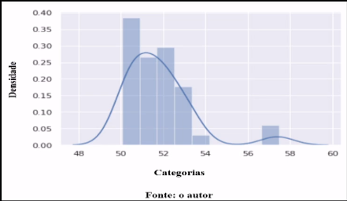

> Um exemplo para analisarmos.
> Cenário: uma grande quantidade de mudas de árvores da mesma espécoe é entregue para serem plantadas
> Expectativa: é que produzam frutos no mesmo período
> Pergunta: como podemos garantir que alcancemos o resutado esperado?
	Podemos analisar uma distribuição amostral através da seleção de diversos grupos de amostras e calcular as suas respectativas médias

#### A importância das distribuições amostrais
> Como podemos fazer inferências sobre uma população?
	Através do Estudo das Distribuições Amostrais.
	Assim, maximizamos o uso dos recursos financeiros, mão-de-obra e qualidade dos resultados

---

# Aula 4 - Estimação de Parâmetros

## Parâmetros Estatísticos 

#### Definição

> Um componente que utilizamos para descrever uma característica específica de toda a população. Através deles, podemos fazer inferências sobre a população, através de cálculo sobre amostras da população.

### Parâmetro Média

- Considerando os seguintes valores: 3, 5, 2, 2, 3, 1, 2, 1, 3 e 2.
- Cálculo da Média
- Soma tudo e divide pela quantidade de valores
- Média = 2.4

### Parâmetro Mediana

- Valores: 17, 17, 17, 18, 18, 19, 19, 19, 20, 21, 25, 28, 32, 50, 63, 65, 66, 70.
-  Cálculo da Mediana
- Como os valores já estão ordenados do menor para o maior, facilita a nossa vida.
- A quantidade de dados é par, portanto calculamos a média dos dois valores centrais.
- Mediana = (20 + 21)/2 = 20.5

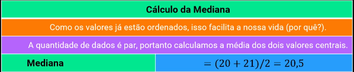

### Parâmetro Moda

- Valores: 
	Grupo1: 2;
	Grupo2: 4;
	Grupo3: 20;
	Grupo4: 22;
	Grupo5: 2;

- Cálculo
- O grupo 4 é o que possui a maior quantidade de estudantes, portanto...
- Moda = 4

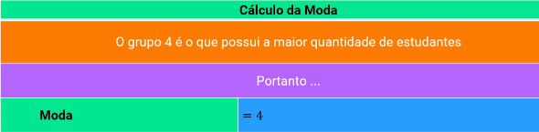

## Erros de Estimação

#### Definição
> São as diferenças entre os valores reais de um parâmetro e os valores estimados por meio de um modelo estatístico ou matemático. Eles podem surgir devido a vários fatores, como:
1. erros de medição.
2. erros de amostragem.
3. especificação incorreta do modelo
4. variação aleatória nos dados

### Real x Estimado

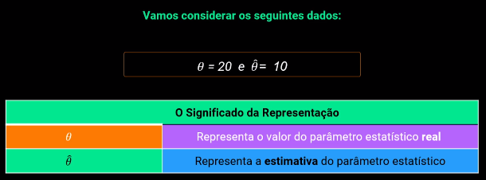

### Medida de Erro Clássico

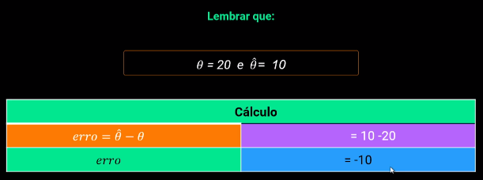

### Medida de Erro Absoluto

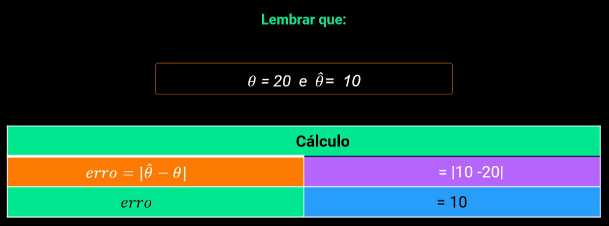

### Medida de Erro Quadrado

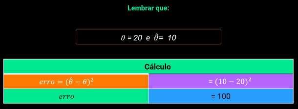

## Intervalos de Confiança

#### Definição
> Uma ferramenta estatística usada para estimar o intervalo de valores em que uma parâmerto populacional, provavelmente, estará com um certo nível de confiança. Nós construímos um intervalo de confiança através de uma amostra da população e um nível de confiança especificado, normalmente 95% ou 99%.

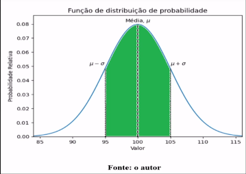

### Tipos de Intervalo de Confiança

- Tipos
- Estimativas Pontuais:
	É um parâmetro que é um valor numérico.
- Estimativas de Intervalo:
	Fornecem um intervalo como a estimativa de um parâmetro.

- Fórmula:
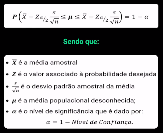

#### Exemplo

> Suponha que estamos analisando o comportamento associado a um determinado ativo nos últimos 60 dias. O retorno médio é de 1% com desvio-padrão de 2%. Nosso objetivo é construir um intervalo de confiança levando em consideração um nível de confiança de 95%.

- Solução: 
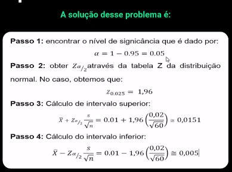

---

# Aula 5 - Teste de Hipótese

## Teste de Hipóteses

### Definição
É uma técnica de estatística na qual testamos uma suposição em relação a um parâmetro populacional.
O principal motivo de utilizarmos o teste de hipótese é devido à inviabilidade de analisar grandes volumes de dados.

### Exemplos
- Testar a confiabilidade de um sistema em relação a outros
- Avaliar a padronização de um processo de produção
- Uma equipe de marketing deseja determinar se uma nova campanha publicitária é mais eficaz do que a antiga.
- Uma instituição educacional deseja testar se um novo método de ensino é mais eficaz do que o método antigo

## Hipótese Nula

### Definição
É o padrão ou suposição inicial de que não há diferença ou nenhum efeito.
A hipótese Nula é representada pelo símbolo H°.

## Hipótese Alternativa

### Definição 
É a declaração que contradiz a hipótese nula e sugere que há uma diferença ou um efeito.
É representada ou por H¹ ou Hæ.

### Exemplo
Uma equipe de marketing deseja determinar se uma nova campanha publicitária é mais eficaz do que a antiga.
A hipótese nula é que não há diferença na taxa média de resposta entre as duas campanhas, enquanto a hipótese alternativa é que a nova campanha tem uma taxa de resposta maior.
A equipe pode coletar dados sobre as taxas de resposta de uma amostra de clientes e realizar um teste de hipótese para determinar se a diferença é estatisticamente significativa,

## Erros de Estimação

