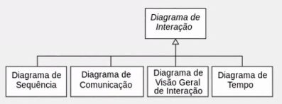

# Prática Integradora Games Engines

## Aula 01 - Game Design Canvas I

### Definição
Game Design pode ser entendido como o processo de criar a disputa e as regras de um jogo, ou ainda de forma mais simples, como o ato de decidir o que um jogo deveria ser.

- O Stakeholder principal é o Cliente/Jogador.

### Engenharia de Requisitos
Deve-se: Identificar os interessados > Reconhecer o ponto de vista > Trabalhar em busca de colaboração.

Ao contrário de um software convencional que normamente partem de um problema e constroem uma solução tecnológica, os jogos são feitos na maioria dos casos para proporcionar diversão.

- Estudo de Viabilidade:
É um estudo preliminar dos requisitos do negócio, que determina se vale a pena desenvolver o sistema proposto.

- Exemplo:
O jogo contribui para os objetivos do jogador e do estúdio?

O jogo pode ser implementado com a tecnologia atual e dentro do orçamento?

O jogo pode ser integrado com outros jogos e/ou plataformas de distribuição?

- Elicitação e Análise:
Nesta atividade, você trabalhará com o usuário final do jogo para entender por que, como, quando, o que e onde o jogador gosta de jogar e/ou usar o jogo.

- Especificação e Documentação:
É uma etapa muito importante do processo de desenvolvimento de jogos, uma vez que possibilitará o entendimento e a definição completa do comportamento do game design, mecânica, game play e players.

Após, é fundamental realizar a documentação que pode ser por meio de Diagramas ou Relatórios que descreverão:

- Requisitos do Usuário: funções e restrições.

- Especificação do Jogo: indicativo de como será e o que vai fazer.

### Metodologia
- Workshop:
Pode ser utilizado com o objetivo de simplesmente apresentar o conceito do jogo e capturar as considerações e percepções, mas também pode ser o canal para acionar um trabalho em equipe como é o caso do Brainstorming e o JAD.

- Brainstorming:
Criar equipes na qual um jogador (com características da persona) seja o facilitador e que tenha como objetivo acionar a equipe em um exercício de branstorming.

É um exercício de criatividade onde todos dão ideias de como deveria ser o jogo, não se deve fazer julgamentos e/ou crítica nesse exercício.

- Joint Application Design - JAD:
Criada pela IBM, é um tipo de reunião com usuários e analistas que tem por objetivo projetar um protótipo de sistemas juntos.

- Design Sprint:
Método criado dentro do Google a partir do Design Thinking que possibilita em pouco tempo e com trabalho colaborativo desenvolver uma ideia e seus requisitos para ativação.

Tudo acontece dentro de 5 dias, separados da seguinte forma:
1. Entendimento - Mapas de jornada e mapas de empatia.
2. Esboço - Hipóteses e ideias.
3. Decisão - Storyboard como o jogo vai interagir com os usuários.
4. Prototipagem - Sai do papel e se torna um protótipo.
5. Validação - Protótipo entra em processo de testes e feedbacks.

- Golden Circle:
Ajuda a encontrar o propósito e gerar impacto. Por meio de três perguntas: Por que? - Como? - O quê? - Nessa ordem.
O conceito busca criar valor, engajar o público com uma causa e inspirar pessoas.

### Analise de Jogos Existentes

#### Concorrentes Diretos:
São aqueles que vende e/ou entrega o mesmo tipo de jogo para um mesmo público-alvo, com uma mesma faixa de preço em um mesmo tipo de plataforma.

#### Concorrentes Indiretos:
São aqueles que não vende o mesmo tipo de jogo, mas que atinge seu público-alvo com uma estratégia clara de substituição de produto.

#### SWOT:
Conhecida também como a avaliação global das forças, fraquezas, oportunidades e ameaças de uma empresa, produto e/ou serviço é denominada SWOT.
- Strengths - Forças
- Weaknesses - Fraquezas
- Opportunities - Oportunidades
- Threats - Ameaças

## Aula 02 - Game Design Canvas II

Jogo utilizado como exemplo para a aula: Crossy Road.

O **Business Model** Canvas ou "estrutura do modelo de negócios" é uma ferramenta de gerenciamento estratégico.

Originalmente proposta pelo designer suíço **Alexander Ostwald** (2000), o Canvas materializa a Business Model Generation, ferramenta utilizada em muitas situações como projetos, negócios e jogos, por exemplo.

### Game Design Canvas
É um framework para rapidamente definir os elementos fundamentais de um jogo.

Ele permite sintetizar rapidamente as ideias que irão contribuir para o desenvolvimento do jogo, de forma a apresentar uma visão geral do projeto em um único painel.

### Game Concept
Consiste em atender às necessidades e determinar a responsabilidade do próprio jogo, destacar seu nome, objetivo, intenção e inspiração para o conceito.

### Game Player
Descreve as informações sobre quem vai jogar, desde a idade do jogador até a comunidade em que seu público-alvo pode estar envolvido.

### Game Play
Desempenho do jogo em si, destacando seus estágios de início, meio e fim de acordo com os limites e regras dentro do espaço definido.
Necessário: Regras, Metas, Recompensas, Danos/Punições.

### Game Flow
Aqui você terá que tentar representar o tempo de jogo vivido pelo jogador, destacando o conceito de loops, permanência do comportamento do jogo e tomada de decisão.
- Desafio em escolher melhor rota
- Antecipar posições de carros, trens e toras de madeira (Esse é um exemplo do jogo Crossy Road)

### Game Core
Você deverá apontar os elementos da construção do jogo, descrever o mecanismo das regras, a dinâmica dos objetivos e a beleza dos componentes de modelagem do jogo.
- Toque na tela gera movimento do personagem nas quatro direções
- Múltiplos toques geram uma sequência de movimentos rápidos
- Captura do personagem quando estiver na borda da câmera
- Após cada avanço de 50 (exemplo) metros, deve-se aumentar o volume do tráfego
- Após cada avanço de 200 (exemplo) metros, deve-se aumentar a velocidade do tráfego
- Gráficos isométricos e em Qubicles
- Uso de uma ferramenta específica para modelagem dos personagens
- Personagens representados por animais diversos
- Animações de movimentos para cada personagem
- Imagens de "estar esmagado" para cada personagem
- Loja virtual para a aquisição de personagens
- Exibição de vídeos promocionais para ganhar créditos extras
- Apenas efeitos sonoros como áudio do jogo

### Game Interaction
Nesse item você deverá ressaltar que o ambiente de execução do jogo em si é diferente da plataforma, dos recursos de implementação e da tecnologia envolvida.
- Plataforma Mobile
- Toques na tela para controle de acordo com a posição corrente do personagem
- Menu inicial com opções de configuração, loja virtual e seleção de personagem
- Exibição de créditos e km percorridos na tela do jogo
- Pop-ups para compartilhar Pictures de falha, reiniciar partida, iniciar vídeos etc

### Game Impact
Defina o que o jogo deve trazer para o jogador, destacando diferentes motivações e motivos para emoção, diversão e aprendizado, que podem ou não ser medidos.
- Jogo simples e divertido (Frogger sem fim)
- Frustação leve (não pense que eu chegarei tão longe)
- Só mais uma vez (reviravolta rápida para mais uma partida)
- Nostalgia retrô (estilo isométrico)
- Socializável (distribuição de Pictures de falha)

### Game Business
Indique aqui se o projeto pode ter problemas mercadológicos, pontos fracos, ameaças e até mesmo de posicionamento de mercado e/ou segmentação.
- ReDesign de um game de sucesso
- Poucos concorrentes na época de lançamento
- Game centers para distribuição do jogo
- Venda de personagens como forma de receita
- Jogo simples e de baixo custo de produção

### Levels e Mecânica
Assim como um bom livro, os jogos precisam manter os jogadores interessados.

O **Level Design** consiste na criação de leveis, ou seja, níveis em jogos digitais sejam eles campanhas, missões, rounds etc.

A criação de um nível tipicamente começa com um conceito de arte, esboço, renderização e modelos físicos.

O layout do mapa possui vários estágios de desenvolvimento, que podem variar muito de acordo com os diferentes tipos de jogos.

Para designer de jogos Dan Taylor, existem 10 princípios para um bom design de níveis, são eles:

1. Ser divertido
2. Contar história além das palavras
3. Dizer o que fazer mas não como
4. Ensinar
5. Surpreender
6. Capacitar
7. Permitir controle de dificuldade
8. Ser eficiente
9. Criar emoção
10. Ser movido pela mecânica do jogo

O **Pacing** será necessário para descrever cada nível acrescentando o Pace ou pacing, ou seja, o passo, ritmo, frequência em que algo acontece no jogo.

## Aula 03 - UX Design em Jogos

O **Design de Experiência do Usuário** é como o uso de produtos, sistemas ou serviços podem ser realizado de forma a equilibrar os aspectos reais, experimentais e funcionais gerando assim valor por meio da interação.

### Customer Centricity
O jogo pode ter o seu valor percebido por meio de dois focos:

1. Product Centric
2. Customer Centric

A Experiência do consumidor por meio da usabilidade do jogo precisa ser memorável.

### Usabilidade
É um atributo de qualidade que mede a facilidade de uso de uma interface de produto/serviço.

### Interface
É como o design do seu jogo se comunica com o usuário, ou seja, como o jogador interage com o jogo criado.

### 10 Heurísticas - Jakob Nielsen
1. Status Visível
2. Mundo Real
3. Controle mas com liberdade
4. Consistência
5. Prevenção de erros
6. Conscientização
7. Eficiência
8. Minimalismo
9. Ajude a identificar e corrigir erros
10. Documentar

### 5 Funções de uma boa usabilidade
1. Aprendizagem
2. Eficiência
3. Memorabilidade
4. Prevenção de Erro
5. Satisfação

### Imergir e Conhecer
Como o foco é o ser humano, precisaremos imergir mais ainda no que queremos com nossos públicos.

Um exercício que pode ser feito para refletir sobre os **stakeholders** é o **Mapa de Atores**.

Contém: Coração / Atores Diretos / Atores Indiretos.

1. Coração:
Comece pelo "coração", aqui se representa as pessoas e/ou grupos afetados pelo jogo. É o jogador.

2. Atores Diretos:
São as pessoas interessadas em contribuir para a solução de problemas ligados a proposta do jogo.

3. Atores Indiretos:
São aquelas pessoas que não estão diretamente relacionados ao desafio, mas podem precisar de ajuda para resolvê-lo em futuras parcerias.

### Criar e Desenvolver
Uma forma de criar a experiência do usuário é usando a jornada do usuário.
O objetivo de se desenvolver a Jornada do Usuário é compreender como o usuário se relacionará com o jogo, ou seja, com esse exercício você descobrirá detalhes que não havia pensado na primeira versão da proposta.

### Evidência Física

- Qual a jornada que o jogador enfrenta, sem o seu jogo?
- Por onde ele caminha, do começo ao fim da experiẽncia?
- Como o jogo se manifesta em sua jornada?
- O que o jogo pode propiciar para o jogador?

### Ações do Usuário

- Quando o usuário faz uso do seu jogo, quais são os seviços ou experiências perceptíveis?
- Quais são os pontos de contato do jogo que você oferece?
- O que o jogador precisará fazer para jogar?

### Ações de Bastidores

- Quais são os serviços que o usuário não percebe que está acontecendo, mas são fundamentais para o bom desenvolvimento do serviço?

### Sistemas de Apoio

- Olhando toda a jornada do usuário, você deverá avaliar os recursos necessários para desenvolvimento do game, considerando os que já estão acessíveis ou próximos e outros que ainda precisam ser buscados.

### Focus Group

Técnica de pesquisa qualitativa que consiste em reunir um grupo de pessoas para discutir um tema específico.
São muito utilizados em pesquisas de mercado e no contexto da User Experience. São uma forma de obter insights sobre as percepções e opiniões dos clientes em relação a um assunto espefícico.

1. Planeje suas perguntas:

Saber com antecedência o que você precisa saber vai te ajudar a otimizar o seu tempo e dos seus entrevistados.

2. Nomeie um moderador e um assistente:

Separe em sua equipe alguém para moderar os debates e um assistente para anotar todas as percepções.

3. Crie um ambiente confortável:

Peça a autorização para fazer a pesquisa qualitativa e informe como as respostas poderão contribuir para o projeto. Se possível ofereça água, lanche e conforto.

4. Tenha a mente aberta:

Com o grupo focal, você poderá aprender que seu projeto não é interessante, esteja aberto para isso. Não imponha o seu ponto de vista, mas acolha a de todos os envolvidos.

5. Dê poder aos participantes:

Diga ao grupo que eles são os especialistas, que você está ali para aprender com eles por meio dessa experiência.

6. Seja atencioso, porém, neutro:

Faça perguntas abertas que propiciará as pessoas falaram melhor sobre suas percepções. 

7. Faça uma pergunta de cada vez:

Repita as expressões-chave de sua pergunta para manter a conversa focada. Permita períodos de silêncio enquanto os participantes reúnem ideias.

## Aula 4 - UML em Jogos Digitais

A linguagem UML (Unified Modeling Language), desenvolvida por Grady Booch, Ivar Jacobson e James Rumbaugh (1995) na Rational Software, se tornou a linguagem de modelagem de software padrão adotada internacionalmente pela indústria de engenharia de de software.

A UML não é uma linguagem de programação, mas de modelagem.

O objetivo é ajudar você a definir as características do jogo, como seus requisitos, seu comportamento e sua estrutura lógica.

A UML trata-se de diagramas, que são representações gráficas, geralmente parcial, de um modelo de sistema.

Os **diagramas podem ser:**

- Estáticos/Estruturais
- Dinâmicos/Comportamentais

### Diagrama de Classes

Este é o diagrama mais usado da UML, utilizado principalmente para auxiliar na coleta e análise de requisitos, no qual se determina as necessidades dos usuários. Basicamente ele descreve o que deve estar presente no sistema modelado.

Repara que cada classe é descrita por meio de atributos e operações.

Além disso, cada associação possui uma multiplicidade que pode ser:

Para fazer um diagrama de classe é importante entender os tipos de relacionamentos que cada classe pode ter.

### Diagramas Estruturais

Estruturais ou estáticos são aqueles baseado em estruturas estáticas por meio de objetos, operações, relações e atributos.

- **Diagrama de Objetos**

Representa os objetos do diagrama de classes em um determinado momento.

- **Diagrama de Componentes**

Mostra as peças que constituem o componente, como arquivos de código-fonte, bibliotecas de programação ou tabelas de banco de dados.

- **Diagrama de Implantação**

Demonstra a organização de elementos de um sistema para a sua execução.

- **Diagrama de Pacotes**

Usado para organizar elementos de modelo e mostrar dependência entre eles.

- **Diagrama de Estrutura Composta**

Usado para modelar colaborações.

- **Diagrama de Perfil**

Representa um mecanismo de extensibilidade que permite que as metaclasses no metamodelo existente sejam estendidas para se adequar a diferentes propósitos.

### Diagramas Comportamentais

Comportamentais(Dinâmicos) são aqueles com comportamento dinâmico por meio de colaboração entre os objetos e mudanças de seus estados internos.

- **Diagrama de Caso de Uso**

Demonstra e/ou descreve funções de alto nível e escopo de um sistema, eles podem identificar as interações entre o sistema e seus agentes.

- **Diagrama de Atividade**

Apresenta os passos a serem seguidos para a conclusão de uma atividade.

- **Diagrama de Máquina de Estados**

Composto por estados, transições, eventos e atividades, é usado principalmente para modelar o comportamento de interfaces, classes ou colaborações.

- **Diagrama de Interação**

Os diagramas de interação são 4: Sequência; Comunicação; Visão Geral de Interação e Tempo.

### Diagramas de Interação

É um diagrama UML usado para mostrar o comportamento interativo do sistema.

- **Diagrama de Comunicação**

Foca na organização estrutural de objetos que enviam e recebem mensagens.

- **Diagrama de Sequência**

variante do diagramde de atividade que apresenta uma cisão geral do sistema e/ou processo de negócios.

- **Diagrama de Visão Geral de Interação**

Também é uma variação do diagrama de atividades e cria uma visão geral do controle de fluxo.

- **Diagrama de Temporização**

Apresenta o comportamento dos objetos e sua interação em uma escala de tempo.

